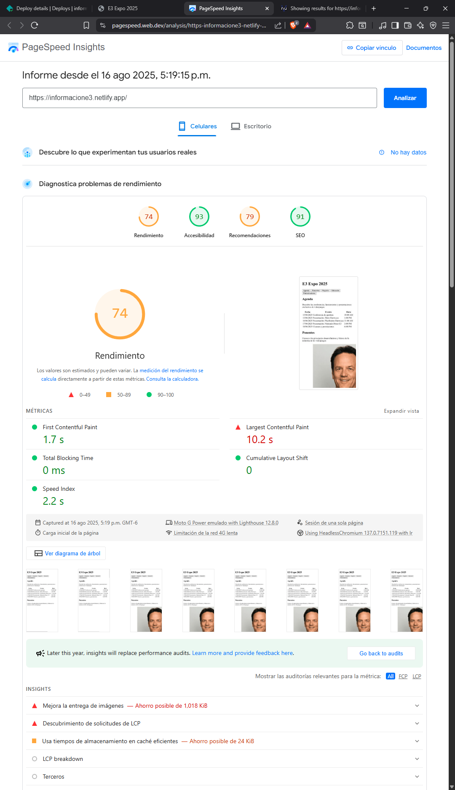
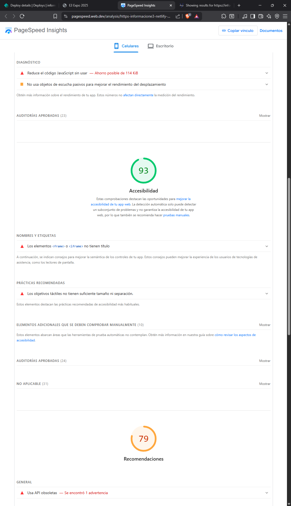
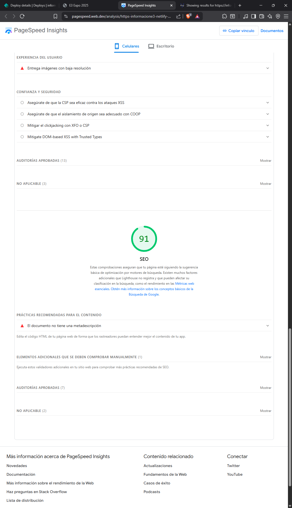
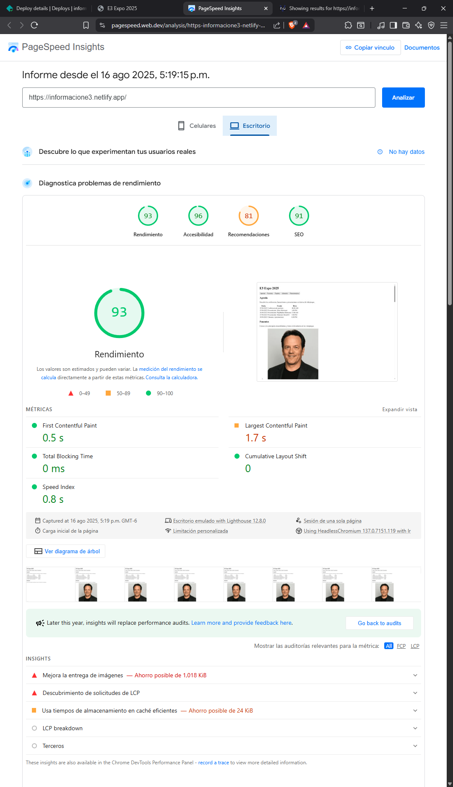
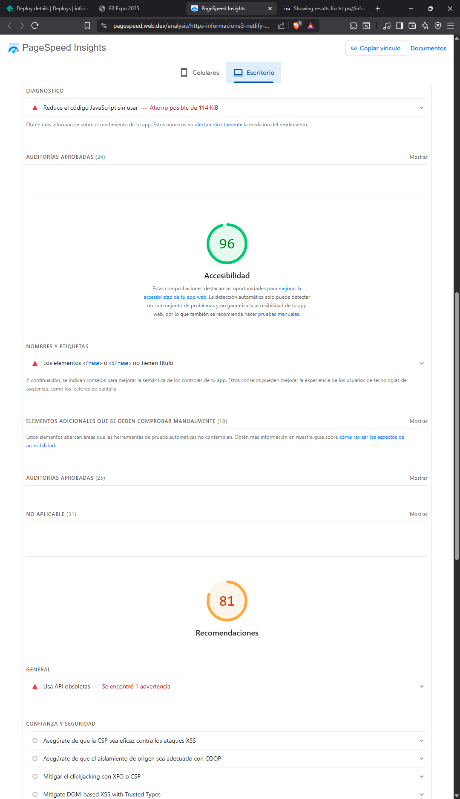
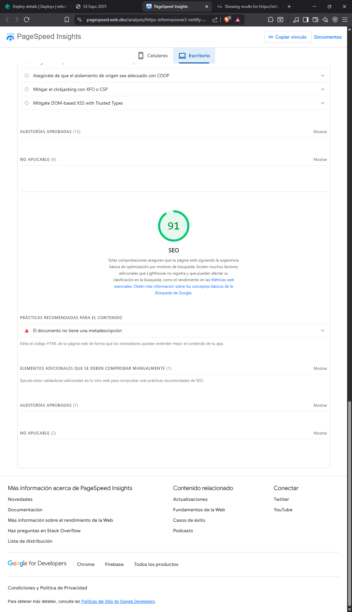

# Información de la E3 2025

Este sitio web muestra la información de las actividades que se realizarán en la E3. En este sitio web se puede encontrar la información tales como la hora de las actividades, los expositores, el lugar del evento entre otros. El propósito del sitio web es orientar a las personas en un evento masivo como lo es en este caso la E3.

# Estructura semántica del sitio

1. **\<!DOCTYPE html\>:** Se utilizó para indicarle al navegador que se está utilizando un documento HTML.

2. **\<html\>:**  Se indicó para iniciar el documento HTML.

3. **\<head\>:**  En este se pudo la información del sitio web.

4. **\<meta\>:**  Se utilizó para indicar el conjunto de caracteres que se utilizarán en el sitio web, además de indicar el tamaño del sitio web.

5. **\<title\>:**  Se utilizó para indicar el nombre del sitio web.

6. **\<body\>:**  Se utilizó para modelar el cuerpo completo del sitio web.
7. **\<header\>:**  Se utilizó para indicar el nombre del sitio web, además aquí se puso los botones de navegación del sitio web.

8. **\<h1\>:**  Se utilizó para indicar los títulos de cada sección.

9. **\<nav\>:**  En esta sección se puso todos los botones de navegación del sitio web.

10. **\<button\>:** En general, se utilizó para que los usuarios pudieran realizar acciones como enviar formularios o navegar a una parte específica del sitio web.

11. **\<main\>:** En esta parte se puso toda la información del sitio web.

12. **\<section\>:** Se utilizó para separar los temas, como expositores, ubicacion, agenda, entre otros.

14. **\<table\> <thead\> \<tr\> \<th\> \<tr\> \<tbody\> \<td\>:**  Este conjunto de etiquetas se utilizaron para crear la agenda de actividades de la E3, de esta manera se logró organizar de mejor manera la información.

20. **\<ol\>:** Se utilizó para ordenar la lista de expositores de la E3.

21. **\<li\>:** Se utilizó para listar las redes sociales que tiene la E3.

22. **\<figure\>:** Se utilizó para presentar a los expositores, se muestra la imagen, el nombre y quienes son.

24. **\<figcaption\>:** Se utilizó para mostrar los nombres y puestos de los expositores.

25. **\<form\>:** Se utilizó para crear el formulario que utilizarán los usuario para indicar a que actividad asistirán.

28. **\<select\>:** Se utilizó para abrir el combobox de la lista de actividades.

29. **\<option\>:** Se utilizó para escribir cada actividad a la que el usuario puede asistir.

30. **\<iframe\>:** Esta etiqueta muestra la ubicación exacta de la E3.

31. **\<footer\>:** Se utilizó para poner la información de las redes sociales de la E3.

# URL pública de Netlify.

**Enlace al sitio web:** https://informacione3.netlify.app

# Validación W3C

## Errores y advertencias

1. Información: Barra final en elementos vacíos no tiene efecto y puede interactuar mal con atributos no citados.

```html
   - 
   - 
   - 
```

2. Advertencia: Las secciones carecen de encabezado. Considere usar h2-h6 o un div si no se necesita encabezado.

```html
   - <section> (x3)
```

3. Advertencia: Posible mal uso de aria-label. Los elementos ya tienen texto visible; considere colocarlo solo en el enlace si es necesario.

```html
   - <li aria-label="Abre la aplicación de email predeterminada para enviar un correo a e3@reedpop.com">Email</li>
   - <li aria-label="Abre una ventana en el sitio de facebook de la E3">Facebook</li>
   - <li aria-label="Abre una ventana en el sitio de instagram de la E3">Instagram</li>
   - <li aria-label="Abre una ventana en el sitio de X de la E3">X (Twitter)</li>
```

4. Advertencia: Uso de múltiples h1. Se recomienda un único h1 como encabezado principal y usar h2-h6 para subtítulos.

```html
   - <h1>Agenda</h1>
   - <h1>Ponentes</h1>
   - <h1>Registro</h1>
   - <h1>Ubicación</h1>
   - <h1>Patrocinadores</h1>
   - <h1>Contacto</h1>
```


### Captura de pantalla uno


### Captura de pantalla dos


## Correciones

1. Se eliminó las barras de la etiqueta img
2. Se cambió de h1 a h2 en las secciones.
3. Se cambió el aria-label a las etiquetas \<a\>
4. Se agregaron las etiquetas \<h3\> en las etiquetas \<section\> que no las tenían.

# Validación de Lighthouse

## Capturas de pantalla de Lighthouse para móviles





## Capturas de pantalla de Lighthouse para pc





## Recomendaciones para mejorar accesibilidad

**Problema:** Los objetivos táctiles no tienen suficiente tamaño ni separación.
**Solución:** Hacer los botones más grandes con ayuda del CSS.

## Accesibilidad aplicada

Se utilizó el aria-label en dos etiquetas. En la etiqueta **\<a\>** para dar una descripción a los enlaces externos a redes sociales, debido que los enlaces no tiene una descripción de lo que hacen o hacia donde llevan. En la etiquita **\<form\>** se utilizó para indicar que es lo que hace ese formulario y que es lo que se espera de los usuarios.

El tabindex se utilizó en la sección de los expositores, específicamente en las imágenes, ya que esto ayuda a recorrer fácilmente las imágenes de los cuatros expositores.