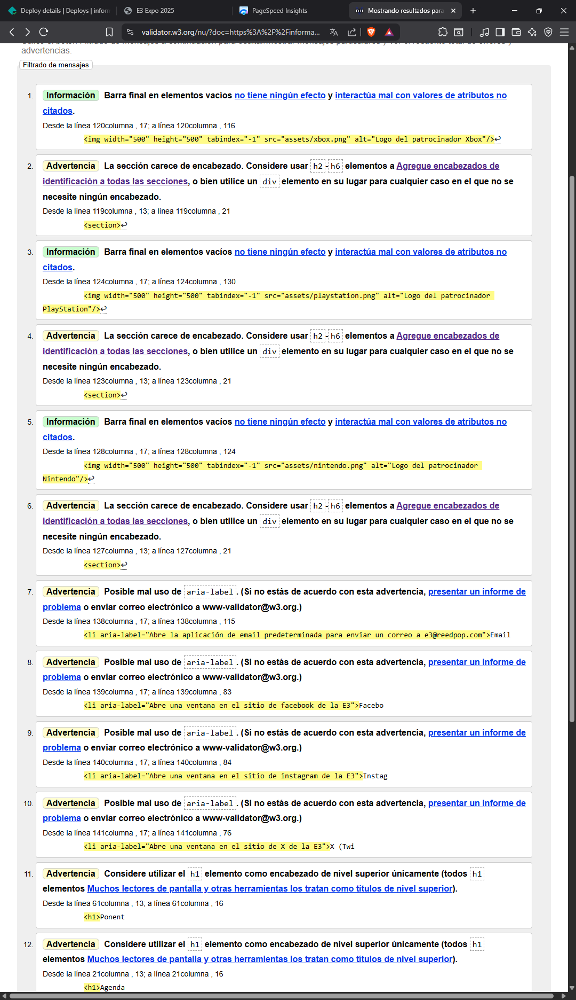
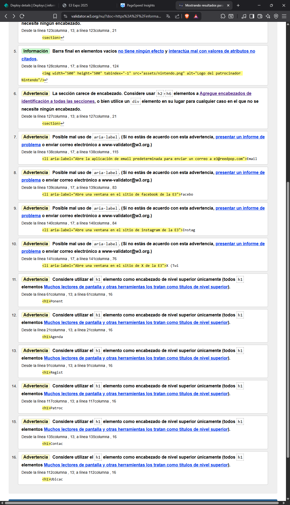

# Información de la E3 2025

Este sitio web muestra la información de las actividades que se realizarán en la E3. En este sitio web se puede encontrar la información tales como la hora de las actividades, los expositores, el lugar del evento entre otros. El propósito del sitio web es orientar a las personas en un evento masivo como lo es en este caso la E3.

# Estructura semántica del sitio

1. **\<!DOCTYPE html\>:** Se utilizó para indicarle al navegador que se está utilizando un documento HTML.

2. **\<html\>:**  Se indicó para iniciar el documento HTML.

3. **\<head\>:**  En este se pudo la información del sitio web.

4. **\<meta\>:**  Se utilizó para indicar el conjunto de caracteres que se utilizarán en el sitio web, además de indicar el tamaño del sitio web.

5. **\<title\>:**  Se utilizó para indicar el nombre del sitio web.

6. **\<body\>:**  Se utilizó para modelar el cuerpo completo del sitio web.
7. **\<header\>:**  Se utilizó para indicar el nombre del sitio web, además aquí se puso los botones de navegación del sitio web.

8. **\<h1\>:**  Se utilizó para indicar los títulos de cada sección.

9. **\<nav\>:**  En esta sección se puso todos los botones de navegación del sitio web.

10. **\<button\>:** En general, se utilizó para que los usuarios pudieran realizar acciones como enviar formularios o navegar a una parte específica del sitio web.

11. **\<main\>:** En esta parte se puso toda la información del sitio web.

12. **\<section\>:** Se utilizó para separar los temas, como expositores, ubicacion, agenda, entre otros.

14. **\<table\> <thead\> \<tr\> \<th\> \<tr\> \<tbody\> \<td\>:**  Este conjunto de etiquetas se utilizaron para crear la agenda de actividades de la E3, de esta manera se logró organizar de mejor manera la información.

20. **\<ol\>:** Se utilizó para ordenar la lista de expositores de la E3.

21. **\<li\>:** Se utilizó para listar las redes sociales que tiene la E3.

22. **\<figure\>:** Se utilizó para presentar a los expositores, se muestra la imagen, el nombre y quienes son.

24. **\<figcaption\>:** Se utilizó para mostrar los nombres y puestos de los expositores.

25. **\<form\>:** Se utilizó para crear el formulario que utilizarán los usuario para indicar a que actividad asistirán.

28. **\<select\>:** Se utilizó para abrir el combobox de la lista de actividades.

29. **\<option\>:** Se utilizó para escribir cada actividad a la que el usuario puede asistir.

30. **\<iframe\>:** Esta etiqueta muestra la ubicación exacta de la E3.

31. **\<footer\>:** Se utilizó para poner la información de las redes sociales de la E3.

# URL pública de Netlify.

**Enlace al sitio web:** https://informacione3.netlify.app

# Validación W3C

## Errores y advertencias

1. Información: Barra final en elementos vacíos no tiene ningún efecto y interactúa mal con valores de atributos no citados.
Desde la línea 120columna , 17; a línea 120columna , 116

```html
          
```

2. Advertencia: La sección carece de encabezado. Considere usar h2-h6 elementos a Agregue encabezados de identificación a todas las secciones, o bien utilice un div elemento en su lugar para cualquier caso en el que no se necesite ningún encabezado.
Desde la línea 119columna , 13; a línea 119columna , 21

```html
          <section>↩
```

3. Información: Barra final en elementos vacíos no tiene ningún efecto y interactúa mal con valores de atributos no citados.
Desde la línea 124columna , 17; a línea 124columna , 130

```html
          ↩     
```

4. Advertencia: La sección carece de encabezado. Considere usar h2-h6 elementos a Agregue encabezados de identificación a todas las secciones, o bien utilice un div elemento en su lugar para cualquier caso en el que no se necesite ningún encabezado.
Desde la línea 123columna , 13; a línea 123columna , 21

```html
          <section>↩   
```  

5. Información: Barra final en elementos vacíos no tiene ningún efecto y interactúa mal con valores de atributos no citados.
Desde la línea 128columna , 17; a línea 128columna , 124

```html
          ↩   
```  

6. Advertencia: La sección carece de encabezado. Considere usar h2-h6 elementos a Agregue encabezados de identificación a todas las secciones, o bien utilice un div elemento en su lugar para cualquier caso en el que no se necesite ningún encabezado.
Desde la línea 127columna , 13; a línea 127columna , 21

```html
          <section>↩     
```

7. Advertencia: Posible mal uso de aria-label. (Si no estás de acuerdo con esta advertencia, presentar un informe de problema o enviar correo electrónico a www-validator@w3.org.)
Desde la línea 138columna , 17; a línea 138columna , 115

```html
          <li aria-label="Abre la aplicación de email predeterminada para enviar un correo a e3@reedpop.com">Email 
```

8. Advertencia: Posible mal uso de aria-label. (Si no estás de acuerdo con esta advertencia, presentar un informe de problema o enviar correo electrónico a www-validator@w3.org.)

```html
Desde la línea 139columna , 17; a línea 139columna , 83

          <li aria-label="Abre una ventana en el sitio de facebook de la E3">Facebo
```

9. Advertencia: Posible mal uso de aria-label. (Si no estás de acuerdo con esta advertencia, presentar un informe de problema o enviar correo electrónico a www-validator@w3.org.)
Desde la línea 140columna , 17; a línea 140columna , 84

```html
          <li aria-label="Abre una ventana en el sitio de instagram de la E3">Instag
```

10. Advertencia: Posible mal uso de aria-label. (Si no estás de acuerdo con esta advertencia, presentar un informe de problema o enviar correo electrónico a www-validator@w3.org.)
Desde la línea 141columna , 17; a línea 141columna , 76

```html
          <li aria-label="Abre una ventana en el sitio de X de la E3">X (Twi
```

11. Advertencia: Considere utilizar el h1 elemento como encabezado de nivel superior únicamente (todos h1 elementos Muchos lectores de pantalla y otras herramientas los tratan como títulos de nivel superior).
Desde la línea 61columna , 13; a línea 61columna , 16

```html
          <h1>Ponent
```

12. Advertencia: Considere utilizar el h1 elemento como encabezado de nivel superior únicamente (todos h1 elementos Muchos lectores de pantalla y otras herramientas los tratan como títulos de nivel superior).
Desde la línea 21columna , 13; a línea 21columna , 16

```html
          <h1>Agenda
```

13. Advertencia: Considere utilizar el h1 elemento como encabezado de nivel superior únicamente (todos h1 elementos Muchos lectores de pantalla y otras herramientas los tratan como títulos de nivel superior).
Desde la línea 91columna , 13; a línea 91columna , 16

```html
          <h1>Regist
```

14. Advertencia: Considere utilizar el h1 elemento como encabezado de nivel superior únicamente (todos h1 elementos Muchos lectores de pantalla y otras herramientas los tratan como títulos de nivel superior).
Desde la línea 117columna , 13; a línea 117columna , 16

```html
          <h1>Patroc
```

15. Advertencia: Considere utilizar el h1 elemento como encabezado de nivel superior únicamente (todos h1 elementos Muchos lectores de pantalla y otras herramientas los tratan como títulos de nivel superior).
Desde la línea 135columna , 13; a línea 135columna , 16

```html
          <h1>Contac
```

16. Advertencia: Considere utilizar el h1 elemento como encabezado de nivel superior únicamente (todos h1 elementos Muchos lectores de pantalla y otras herramientas los tratan como títulos de nivel superior).
Desde la línea 112columna , 13; a línea 112columna , 16

```html
          <h1>Ubicac
```

### Captura de pantalla uno



### Captura de pantalla dos



## Correciones

1. Se eliminó las barras de la etiqueta img
2. Se cambió de h1 a h2 en las secciones.
3. Se cambió el aria-label a las etiquetas \<a\>